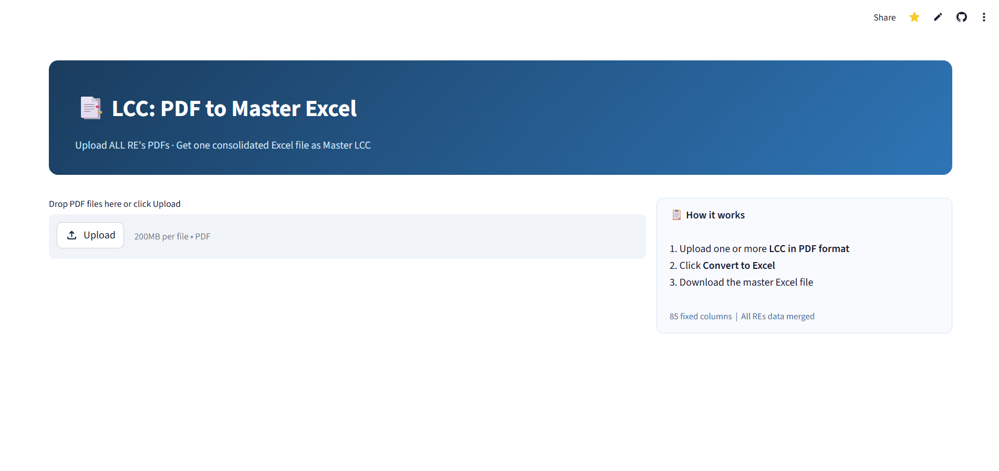
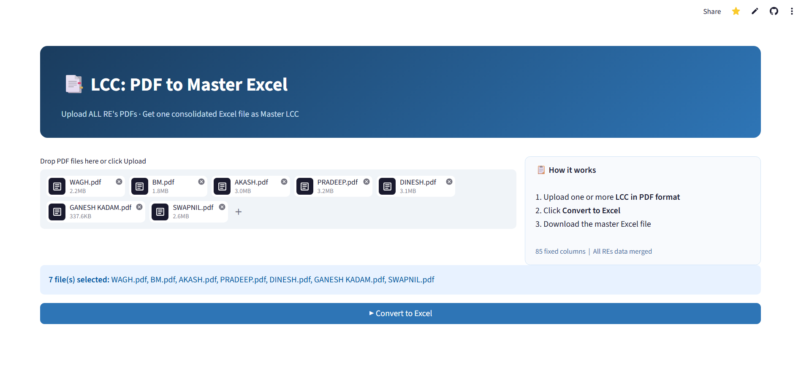
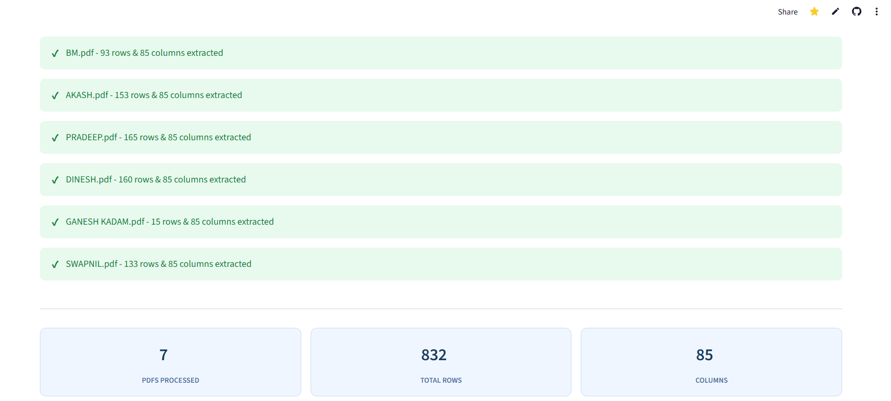

# LCC: PDF to Master Excel

## The Problem

In our branch operations, the internal system only exports the **LCC (Live Contract Collection)** as a PDF, one file per Relationship Executive (RE). A Branch Manager or BTL needs to consolidate all REs' data into a single Master LCC **Excel** for review and follow-up.

The manual process looked like this:
- Download each RE's LCC as a PDF from the system
- Try to convert it to Excel (most online tools are blocked on office laptops so they use personal mobile phone for this)
- Copy-paste each file's data into a master sheet, column by column per Excel
- Repeat this 4 to 5 times every month

It was time-consuming, error-prone, and entirely manual.

**This tool eliminates that entirely.** Upload all the PDFs at once, click Convert, download one consolidated Master LCC Excel in minutes, accurate enough to run daily if needed.

**Live App** [lcc-pdf2excel.streamlit.app](https://lcc-pdf2excel.streamlit.app/)

## The Challenge

PDFs are not spreadsheets. They don't store tables; they store text positioned at X/Y pixel coordinates on a page. The catch with our reports:

- **Column widths are dynamic.** A customer with a long name pushes every column to the right on that row. There are no fixed column boundaries to rely on.
- **Some columns are always empty**  so they produce zero data points, making them invisible to a naive extractor, which then shifts all subsequent columns by one position.
- **Multi-page PDFs** repeat the header row on every page, and Y-coordinates reset to zero on each page, so rows from different pages collide if processed naively.
- **85 fixed columns** must appear in the exact same order in every output file, regardless of which PDF they came from.

## How It Was Solved

Instead of using a traditional PDF table extractor, the app renders each page as HTML (via PyMuPDF), which exposes the precise `left:` and `top:` CSS pixel position of every text element.

**Column positions are learned from data rows, not the header.**
The header row suffers from text overflow where adjacent column titles merge into one element when they are too close. Data cells (individual numbers and short codes) don't have this problem. So the app scans the first 20 data rows, clusters their X positions, and uses those as column boundaries.

**Empty columns are injected from the header.**
If a column has no data across the whole PDF (e.g. SaleType), it leaves no X-position footprint in data rows. To prevent the next column from shifting left, the header's X position for that column is injected as a placeholder.

**Pages are processed independently.**
Each page gets its own coordinate space. Column structure is learned from the first page and reused, so multi-page PDFs extract correctly without row merging.

**Result:** ~0.35 seconds per PDF, 85 columns, correct order, every time.

## Output

| What | Detail |
|---|---|
| Columns | Always exactly 85, in fixed order |
| Numeric columns | Stored as numbers (usable in Excel formulas) |
| Date columns | Stored as real Excel dates, formatted DD-MM-YYYY |
| Total row | Automatically excluded |
| Multiple PDFs | All rows merged into one sheet |

## Screenshots

**Landing page**

**PDFs selected, ready to convert**

**After extraction — 7 PDFs, 832 rows, 85 columns**

## Tech Stack

| | |
|---|---|
| **PyMuPDF** | PDF to HTML rendering for pixel-accurate text positions |
| **pandas** | DataFrame assembly and type coercion |
| **openpyxl** | Excel file generation with date formatting |
| **Streamlit** | Web UI, deployed on Streamlit Cloud |

